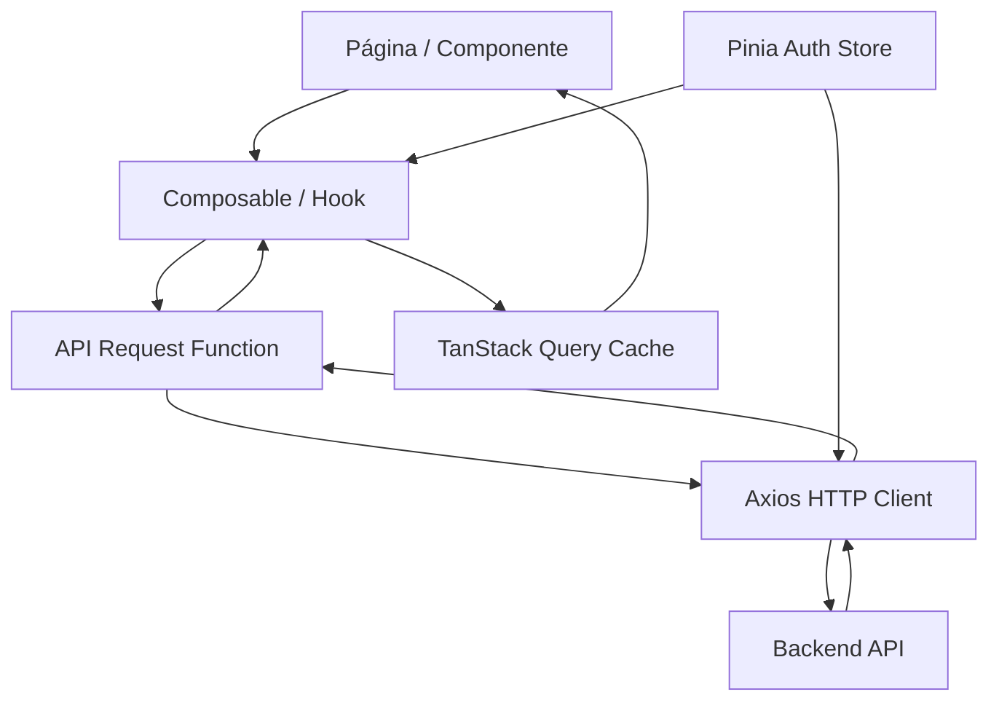

# 02 - Architecture

## Fluxo da aplicação



## Camada por camada

```
┌──────────────────────────────────────────────┐
│  PÁGINAS (modules/)                          │
│  Home, Login, Calendar, Profile             │
│  ┌────────────────────────────────────────┐  │
│  │ COMPONENTES (components/ + modals/)    │  │
│  │ Topbar, CalendarCard, EventListPanel   │  │
│  │ NewEvent, NewCalendar, CalendarActions │  │
│  │ DayEvents                              │  │
│  └────────────────────────────────────────┘  │
│  ┌────────────────────────────────────────┐  │
│  │ REQUESTS (requests/)                   │  │
│  │ useQuery / useMutation hooks           │  │
│  │ + raw API functions                    │  │
│  └────────────────────────────────────────┘  │
│  ┌────────────────────────────────────────┐  │
│  │ SERVICES (services/http.ts)            │  │
│  │ Axios instance + interceptors          │  │
│  └────────────────────────────────────────┘  │
│  ┌────────────────────────────────────────┐  │
│  │ STATE                                   │  │
│  │ TanStack Query (server state)          │  │
│  │ Pinia (auth only)                      │  │
│  │ localStorage (token, refreshToken,     │  │
│  │              user)                      │  │
│  │ reactive/ref (local component state)   │  │
│  └────────────────────────────────────────┘  │
└──────────────────────────────────────────────┘
```

---

## Onde ficam as regras de negócio

- **Validação de formulários**: dentro do próprio componente (ex: `validateForm()` no `NewEvent.vue`, `validateRegisterField()` no `Login/index.vue`)
- **Validação de senha**: regex no componente de Login
- **Filtros de eventos**: funções computadas nos componentes (`Home/index.vue` filtra por owner e por calendar)
- **Verificação de permissão**: `isOwner` computed no `CalendarActions.vue` e guards no router
- **Não existem "services" de regra de negócio separados** — as regras estão nos componentes ou nos composables de request

## Onde ficam chamadas HTTP

- **Pasta `src/requests/`**: cada arquivo exporta uma função de request pura + um hook TanStack Query
  - Queries: `useQuery()` com `queryKey`, `queryFn`, `staleTime`
  - Mutations: `useMutation()` com `mutationFn`
- **Arquivo `src/services/http.ts`**: instância Axios compartilhada com base URL e interceptors

## Onde ficam componentes

| Local | Tipo |
|---|---|
| `src/components/` | Componentes reutilizáveis (Topbar, CalendarCard, EventListPanel) |
| `src/modals/` | Componentes de modal/dialog (NewEvent, NewCalendar, CalendarActions, DayEvents) |
| `src/layouts/` | Layout wrappers (DefaultVueApp) |

## Onde ficam páginas

| Pasta | Página |
|---|---|
| `src/modules/Home/` | Dashboard / Home |
| `src/modules/Login/` | Login + Register |
| `src/modules/Calendar/` | Visão de calendário |
| `src/modules/Profile/` | Perfil do usuário |

## Onde ficam tipos

- `src/types/api.ts` — Todos os tipos compartilhados entre frontend e API
- Tipos locais: definidos dentro do próprio arquivo `.vue` ou `.ts` com `type` ou `interface`

## Onde ficam helpers

- `src/utils/formatDate.ts` — formata `dd/mm/yyyy`
- `src/utils/Authentication/auth.ts` — Pinia store (não é bem um helper, é uma store)

## Onde ficam stores

- `src/utils/Authentication/auth.ts` — Única store Pinia (`useAuth`)
